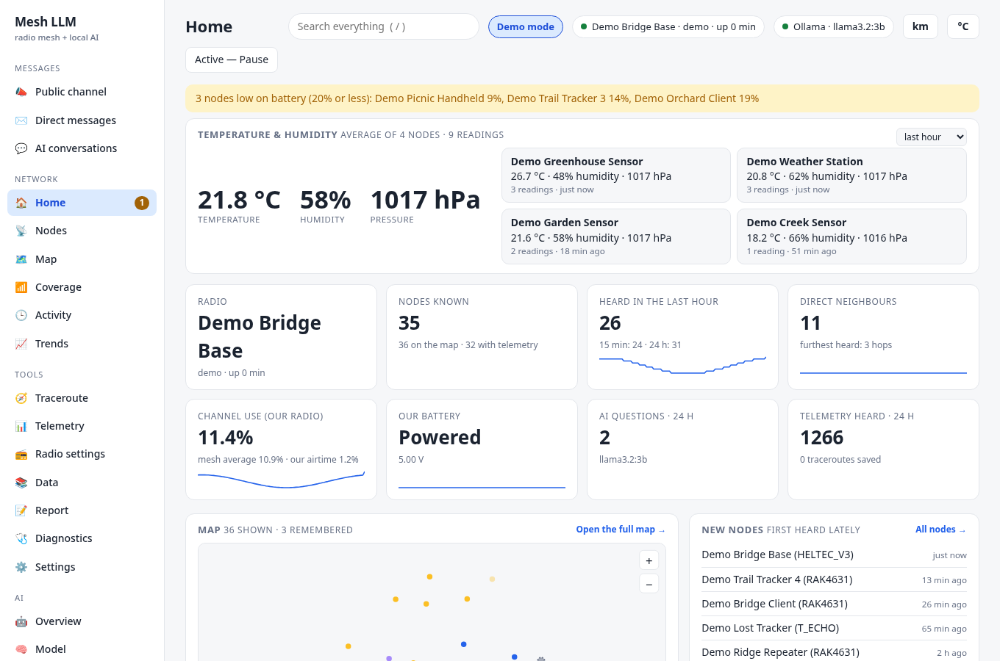
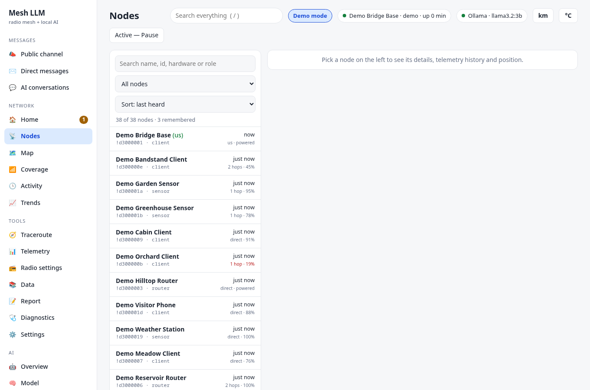
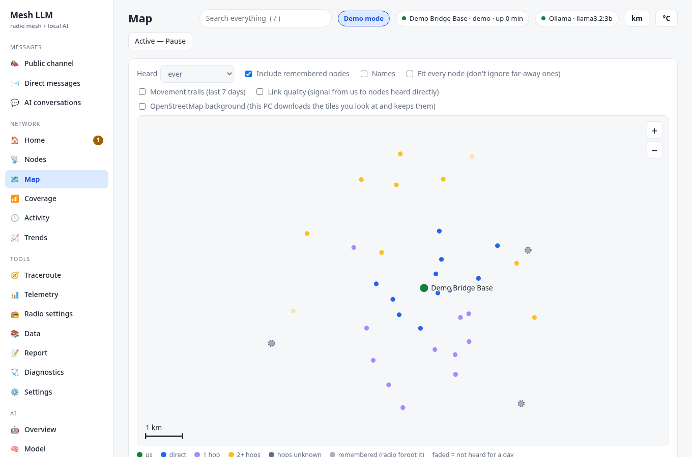
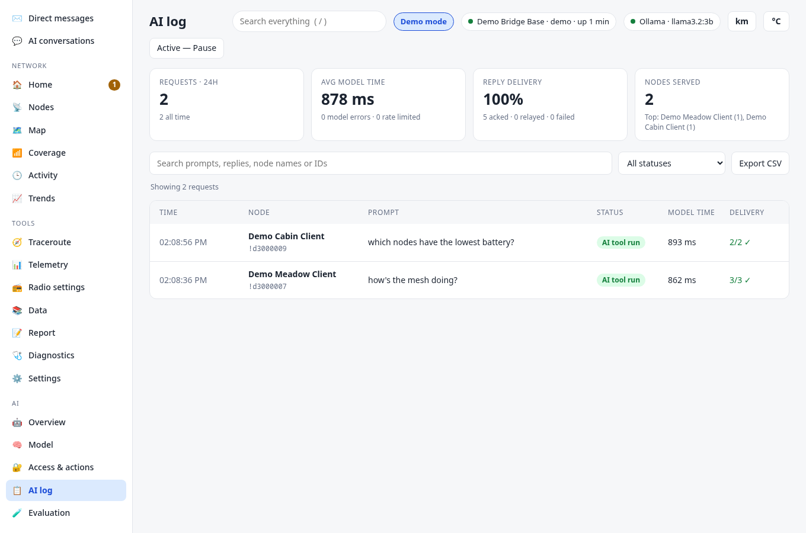

# Meshtastic LLM Bridge

**Ask a local AI questions over a LoRa radio mesh. No internet, no cloud, no account.**

Plug a [Meshtastic](https://meshtastic.org) radio into your computer, run the bridge, and anyone on the mesh can send it a
direct message like `/ai which nodes have low batteries?`. A model running on your own machine through
[Ollama](https://ollama.com) answers, and the reply comes back over the air as short messages. A local web dashboard shows what
is happening on the mesh and lets you control who may ask what.

[](https://github.com/TeamHarrisCali/MeshtasticLLM/actions/workflows/tests.yml)


> [!NOTE]
> **This entire project was generated by AI.** The code, the tests and the documentation were written by Anthropic's Claude models,
> working through [Claude Code](https://claude.com/claude-code), under the direction of a human maintainer
> ([@TeamHarrisCali](https://github.com/TeamHarrisCali)) who sets the goals, owns the repository and has authorised this workflow,
> including AI agents merging reviewed pull requests.
>
> Treat it with the care you would give any code you did not write yourself: read what it does before you give it your radio. An automated
> test suite that fakes the radio and Ollama covers it, but it has had limited time on real hardware
> ([docs/roadmap.md](docs/roadmap.md) lists what is still unproven). See [How this is built](#how-this-is-built).

```text
  phone / node ──LoRa──▶  your radio  ──USB──▶  bridge  ──▶  Ollama (local model)
       ▲                                          │  │
       └──────────── short DM replies ◀───────────┘  └──▶  dashboard at http://127.0.0.1:8080
```

## What it does

- **Answers questions over the radio.** DM a node with `/ai <question>`. Replies are split into balanced, numbered parts that
  fit a LoRa packet, sent with acknowledgements, and re-sent if the radio gives up on one.
- **Knows about your mesh.** The AI can look things up in the data your radio has heard: how many nodes are around, who is
  nearest, low batteries, the temperature outside from sensor nodes, signal quality, nodes gone quiet, the busiest times, one
  node's battery history. It answers from real numbers and says "I can't tell" instead of inventing them.
- **Is safe by construction.** The AI picks from a fixed menu of read-only lookups. It has no shell, cannot touch your files,
  and cannot transmit on its own. See [Safety model](#safety-model).
- **Finds the radio by itself.** Plug it in before or after starting; unplug it, swap it, move it to another USB port, and the
  bridge notices and reconnects.
- **Comes with a full dashboard.** Map, node list with your own labels and notes, coverage and walk test, traceroute, telemetry,
  trends, a daily report, radio settings backup and restore, diagnostics, and an AI log of every question and answer.
- **Runs unattended.** Background start and stop scripts, start at login, daily backups, logs.
- **Is measured.** An evaluation harness scores how reliably a model picks the right tool, with separate development and
  held-out question sets.

Everything runs on your computer. Once set up, the only outbound connections are ones you ask for: model downloads through
Ollama, and the optional map background, whose OpenStreetMap tiles are fetched only for the area you are looking at.

## Screenshots

All of these are from [demo mode](#try-it-without-hardware): simulated nodes and traffic, nothing from a real mesh.

| | |
|---|---|
|  |  |
| **Home**: temperature and humidity from sensor nodes, headline numbers, alerts. | **Nodes**: everything heard, with role, hops, signal and battery; open one for its history, your label and notes. |
|  |  |
| **Map**: nodes coloured by hops away; an optional OpenStreetMap background. | **AI log**: every question, the tool the AI ran, and per-part delivery. |

## Requirements

- A Meshtastic radio connected over USB (firmware 2.5 or newer for the encrypted-DM features).
- [Ollama](https://ollama.com/download) with at least one model that supports tool calling (for example `qwen3.5` or `llama3.2:3b`).
- Python 3.9 or newer. Windows, Linux and macOS are supported. Setup builds its own virtual environment.

## Quick start

```bash
git clone https://github.com/TeamHarrisCali/MeshtasticLLM.git
cd MeshtasticLLM
./setup.sh                 # Linux / macOS     (Windows: double-click setup.bat)
./start_bridge.sh          # runs in the background; ./stop_bridge.sh stops it
```

Setup finds Python, builds `.venv`, installs the dependencies, and checks Ollama and the radio. It is safe to run again at any
time. If something is missing it prints the exact command to fix it, and `./setup.sh --check` reports without changing anything.

Then open <http://127.0.0.1:8080/> and, from another node, send a direct message to your radio:

```text
/ai help
/ai how's the mesh doing?
/ai what's the temperature outside?
/ai where is the nearest router?
/ai has the battery on Hilltop Base been dropping today?
```

**No flags are needed.** The radio is found automatically, and the model and every setting you change in the dashboard are
remembered in the database. Command-line flags exist as optional overrides ([docs/flags.md](docs/flags.md)). To run in the
foreground instead: `.venv/bin/python -m meshllm`.

### Connect over Wi-Fi or Bluetooth

USB is the default. A radio can also be reached without a cable (pick one; the AI's read-only toolbox and the reconnect behaviour are the same):

```bash
.venv/bin/python -m meshllm --tcp 192.168.1.50        # Wi-Fi: the radio's address or host name (port 4403 unless you add :PORT)
.venv/bin/python -m meshllm --ble-scan                # Bluetooth: list nearby radios (name and address), then exit
.venv/bin/python -m meshllm --ble AA:BB:CC:DD:EE:FF   # Bluetooth: connect to one of them (address or name, as the scan printed it)
```

Wi-Fi needs the radio's Wi-Fi switched on and joined to your network; Bluetooth needs a Bluetooth adapter on the computer running the
bridge, so it works on the host only and not inside a container. If your computer already holds the radio's Bluetooth connection it stops advertising and won't show in a scan; pass its address
(`bluetoothctl devices Paired` on Linux) and the bridge connects directly. Only one Bluetooth client can hold the radio, so close the phone app,
and set a PIN in the Meshtastic app (a radio in "No PIN" mode pairs with anyone in range). Either way the bridge reconnects by itself after a drop or a power cycle,
and the dashboard shows the connection as `tcp://host:4403` or `ble:ADDRESS`. Details and tips in [docs/setup.md](docs/setup.md#connecting-over-wi-fi-or-bluetooth).

### Try it without hardware

No radio and no Ollama? Run the whole bridge and dashboard against a simulated mesh:

```bash
.venv/bin/python -m meshllm --demo          # then open http://127.0.0.1:8080/
```

You get about three dozen obviously fake nodes (`Demo Ridge Repeater`, `Demo Trail Tracker 3`, ...) scattered around a public park, with
batteries, sensors, trails, a day of history and live traffic, and once a minute or so a fake node DMs the bridge an `/ai` question
that goes through the real queue, tools and an acked reply. Without Ollama a small scripted model (shown as `demo-scripted`) answers;
if Ollama is running with a tool-capable model, that model is used instead. A "Demo mode" badge shows in the dashboard header.
Nothing is transmitted, nothing connects to a serial port, and everything is kept in a temporary folder that is deleted when you
stop it (Ctrl+C, `kill`, or closing the terminal): your real `audit.db` is never opened. Demo mode listens on this computer only
(`--web-host` must stay `127.0.0.1`), and if port 8080 is taken, for example by your real bridge, use `--web-port 8081`. (The optional map background still downloads OpenStreetMap tiles if you look at the Map page.)

**Linux:** your user needs permission to open the serial port. Setup checks this and tells you which group to join (`dialout` on
Debian and Ubuntu, `uucp` on Arch). Close any other program using the radio's serial port first; only one program can hold it.

## Safety model

A radio mesh is an open channel and any text on it can be hostile, so the AI is deliberately boxed in.

| Layer | What it does |
|---|---|
| **DM only** | The AI answers direct messages that start with `/ai`. It ignores the public channel and never reads it. |
| **Access control** | Open or allow-list mode, a daily cap per node, block list. Blocked nodes get no reply at all. |
| **Tools are opt-in** | A node gets lookups only if you enable it, **pin its public key**, and it messages over a **PKI-encrypted DM** whose key still matches. |
| **Fixed menu** | The model can only *ask* for a tool by name. The code validates the name, the node's level and every parameter, then runs a hand-written handler. Nothing the model says can create a capability. |
| **Read-only** | Every tool reads the bridge's own database. None transmits, and none touches the computer. |
| **Confirmation codes** | Anything that would change something needs a one-time code confirmed over the radio. (Only a demo uses this today.) |
| **Untrusted names** | Node names are chosen by strangers, so they are stripped of control characters and never fed back to the model. |
| **Local dashboard** | The web UI binds to `127.0.0.1` by default. It has no login, so do not expose it to a network you do not trust. |

Details, and what this does *not* protect against (a stolen radio carries a valid key), are in
[docs/ai_tools.md](docs/ai_tools.md). To report a vulnerability, see [SECURITY.md](SECURITY.md).

## The dashboard

Open <http://127.0.0.1:8080/>. Four groups in the sidebar:

- **Messages:** the public channel (read and post by hand, the AI is kept out), direct messages, and what people asked the AI.
- **Network:** Home (alerts, sensors, map), Nodes, Map, Coverage (how far the radio reaches, walk test), Activity, Trends.
- **Tools:** Traceroute, Telemetry, Radio settings (pull, edit and push the radio's config), Data, Report, Diagnostics, Settings.
- **AI:** Overview, Model, Access and tools, the AI log, and Evaluation.

[docs/dashboard.md](docs/dashboard.md) explains every page.

## Documentation

| Page | What is in it |
|---|---|
| [docs/setup.md](docs/setup.md) | Setting up on a new computer, options, start at login |
| [docs/dashboard.md](docs/dashboard.md) | What each dashboard page does |
| [docs/features.md](docs/features.md) | How the bridge behaves: memory, queue, access control, models, telemetry, traceroute, and more |
| [docs/ai_tools.md](docs/ai_tools.md) | The fixed menu of lookups the AI may run, and how it is protected |
| [docs/evaluation.md](docs/evaluation.md) | Measuring how well a model picks tools |
| [docs/ai_usefulness_audit.md](docs/ai_usefulness_audit.md) | An audit of how useful the AI was, and what was done about it |
| [docs/flags.md](docs/flags.md) | Command-line flags (none are needed) |
| [docs/files.md](docs/files.md) | What each file in the project is for |
| [docs/roadmap.md](docs/roadmap.md), [docs/notes.md](docs/notes.md) | Design rules, known gaps, ideas |
| [docs/demo_script.md](docs/demo_script.md) | An 8-minute walk-through for presenting the project |

The same pages can be read inside the dashboard, on **Evaluation** under Write-ups.

## Tests

```bash
python run_tests.py                 # everything, about a minute; no radio or Ollama needed (both are faked)
python run_tests.py channel backup  # only the test files whose names contain these words
```

The tests use a throwaway temporary folder, so your real `audit.db`, `tile_cache/` and `logs/` are never touched.

## Project layout

```text
meshllm/           the package: bridge.py (entry point), actions.py (the AI's tool menu), webroutes.py (dashboard API), ...
meshllm/static/    the dashboard: plain HTML, CSS and JavaScript, no build step
meshllm/tools/     developer tools: tool-choice evaluation and the usefulness audit
tests/             the suite (radio and Ollama are faked)
docs/              documentation          eval_results/   saved evaluation runs
setup_env.py       installer (launched by setup.sh / setup.bat)       start_bridge.* / stop_bridge.*   run in the background
```

Every module starts with a docstring that says what it is for; [docs/files.md](docs/files.md) lists them all. Run the bridge in the
foreground with `python -m meshllm`.

## How this is built

Until now the history on `main` is direct commits. From this point on the project is developed the way a small software team works, with
AI agents as the team members. This is a convention the maintainer has asked for, not something GitHub enforces:

- **One feature branch per task.** Each agent works on its own branch (`feat/...`, `fix/...`, `docs/...`), so work on different things never collides.
- **Every change is a pull request**, described using the [template](.github/PULL_REQUEST_TEMPLATE.md). New behaviour comes with tests, and a bug fix with a test that fails without the fix.
- **A separate reviewer agent reads each pull request cold**, without the author's context, and its findings are recorded on the PR. It is the
  same model family as the author, so it catches mistakes but is not a substitute for a human reading the code.
- **Merged to `main` only when CI is green and the review is clean.** CI runs the test suite on every pull request.

Human contributors are welcome and go through the same flow. See [CONTRIBUTING.md](CONTRIBUTING.md).

## Contributing

Bug reports, hardware reports (what radio, what OS, what happened) and pull requests are welcome. Please read
[CONTRIBUTING.md](CONTRIBUTING.md) first. Known gaps and ideas are in [docs/roadmap.md](docs/roadmap.md).

## License and notices

[MIT](LICENSE). This is an independent project and is not affiliated with or endorsed by the Meshtastic project, Ollama or Anthropic.
"Meshtastic" is a registered trademark of Meshtastic LLC. You are responsible for operating your radio within the radio rules of
your country, and for deciding who on your mesh may talk to your computer.

Map tiles are © [OpenStreetMap contributors](https://www.openstreetmap.org/copyright), fetched on demand and cached locally in
line with the [tile usage policy](https://operations.osmfoundation.org/policies/tiles/).
